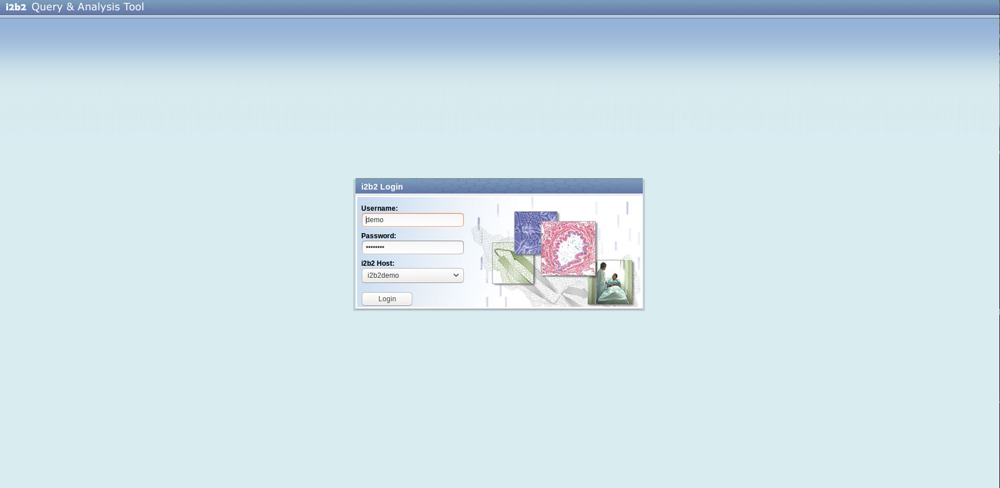
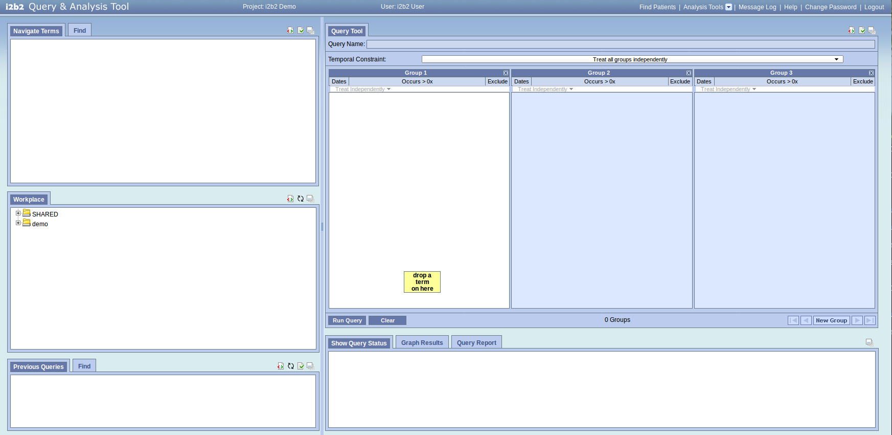

## APP Installation Instructions 

## Install Parameters

None

## After the installation

## Web Client login
URL: add /webclient to the path to get to the i2b2 Web Client

Example:
supposing http://myapp.bibbox.local.domain is the url where bibbox took you when you click on the app instance
then http://myapp.bibbox.local.domain/webclient is the Web Client url

login details:

* user: demo
* password: demouser

## Web Client Administration
URL: change chosenappid with chosenappid-server-d in the app url and then add admin at the end

Example:
Following the previous example the Web Client Administration will be reachable at:
http://myapp-server-d.bibbox.local.domain/admin

## Populate the Database

